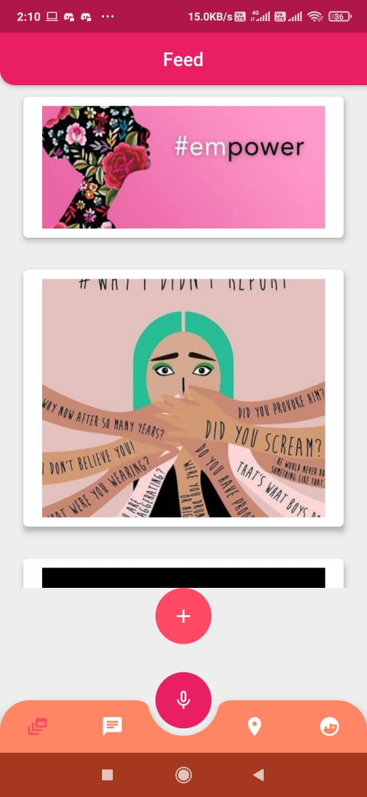

# SafeLink

**FLUTTER MOBILE APP APK -** [[click here]](https://github.com/Ctrl-Alt-Eliiiteee/SaferX/raw/main/SaferX.apk)

Everyone knows that Women feel unsafe in travelling alone at night , working late hours etc. This situation is there because of all the news we here involving women. This application will help change the outlook of the condition of India. Our teams basic goal is to provide a safer place for everyone to stay in and hope to achieve with this application.

Introducing **SafeLink**

It is an android mobile application based in flutter which will ensure Women Safety and Security in India.
This application will be aimed at provided instant help to women in need and also provide longterm education
to women who are not sure how to get rid of risky situations while traveling in any part of India.
There will a number of features of this app :-
-> A interactive live system where the location that a women is travelling will be stated safe or not depending upon number of criminal and harassment cases in that area.
-> Live feed where women can post stories to encourage Women Empowerment.
-> Getting your current location and find nearby police stations.
-> Instant help me button where an SMS will be sent to the concerned nearby police stations and other closeby members with location information when a women feels in danger.
-> Everyone will have an verified account in the app ensuring no scamming of the authorities in the nearby area
-> One on One chat system with concerned authorities thereby allowing women to share their concern.
-> AI chatbot to get help in the app about basic women rights and instructions to follow when in trouble.
-> A profile section with username and profile pic.

This is an all round application that will greatly have an influence in all the women in the country and thereby save someone in trouble.

## Features

1. Easy Sign up and Login with your email and password - powered by **Google Realtime Firebase**.

2. Determining whether a place is safe or not depending on the data taken from government site about that area.
  
3. Have one on one encrypted chat system for communication with the concerned authorities.
  
4. Live feed will involve work in database of uploading and seeing data about women empowerment.
 

 

5. Help me voice integration where your current location will be sent to the concerned nearby authorities (works even in background mode or locked mode).
 

 

6. AI chatbot that speaks to you when u ask them basic questions ,also works in background mode. 
  
 
 7. A Profile Page showing your details and consist of Textfield to register the numbers for help me feature.
 

**Developers :-**

 

We have made this Application with the vision of helping the community in any small way possible and just hope that the women can walk freely even in mid night.
   
   Regards,
   
   **Team Ctrl-Alt-Elite**
