# SafeLink

[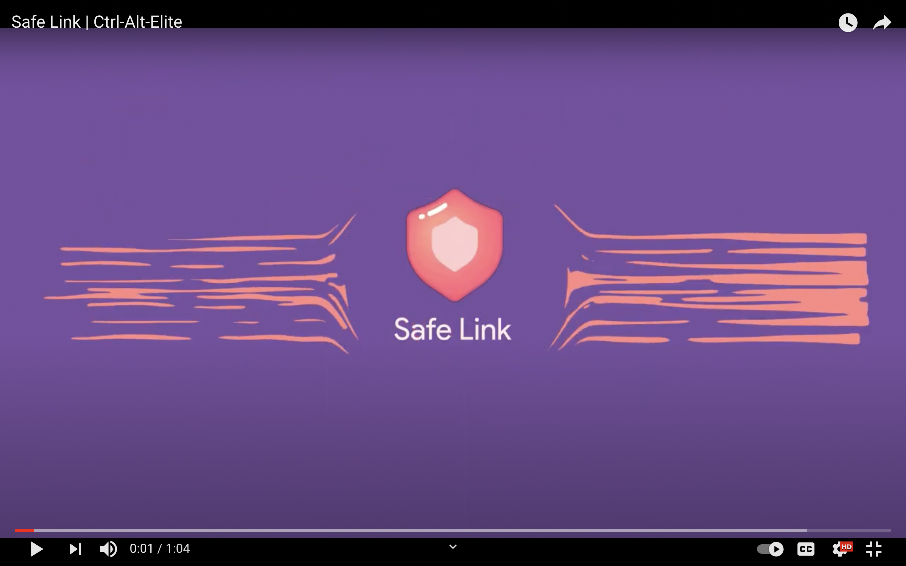](https://youtu.be/FYkfWy6N3Ag)
**(Click the image to go to the youtube video link of the App)**

**FLUTTER ANDROID MOBILE APP APK -** [[click here]](https://github.com/Ctrl-Alt-Eliiiteee/SafeLink/raw/main/SafeLink.apk)
#### Only for android and not operational in IOS devices.

Everyone knows that Women or anyone in fact feel unsafe in travelling alone at night , working late hours etc. This application will help change the outlook of the condition of India. Our team's basic goal is to provide a safer place for everyone to stay in and we hope to achieve that with this application.

##  Introducing **SafeLink**

   

   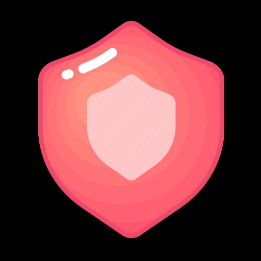 
   

It is an android mobile application based in flutter which will ensure Women Safety or infact Safety of any person and Security in India.
This application will be aimed at provided instant help to women in need and also provide longterm education
to women who are not sure how to get rid of risky situations while traveling in any part of India.
There will a number of features of this app :-
-> A interactive live system where the location that a women is travelling will be stated safe or not depending upon number of criminal and harassment cases in that area.
-> Live feed where women can post stories to encourage Women Empowerment.
-> Getting your current location and find nearby police stations.
-> Instant help me button where an SMS and also a instant call will be sent to the concerned nearby police stations and other closeby members with location information when a women feels in danger.
-> Everyone will have an verified account in the app ensuring no scamming of the authorities in the nearby area
-> One on One chat system with concerned authorities thereby allowing women to share their concern.
-> A profile section with username and profile pic.

This is an all round application that will greatly have an influence in all the women in the country and thereby save someone in trouble.

## Features

1. Easy Sign up and Login with your email and password - powered by **Google Realtime Firebase**.

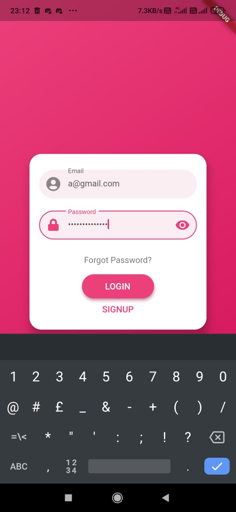

2. Determining whether a place is safe or not depending on the data taken from government site about that area.
 

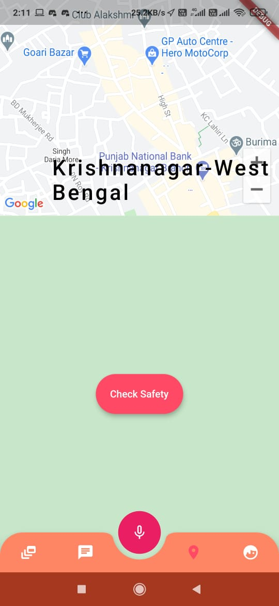 
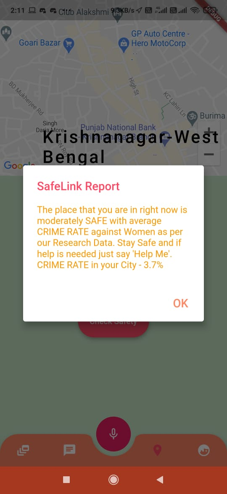 

3. Have one on one encrypted chat system for communication with the concerned authorities.
 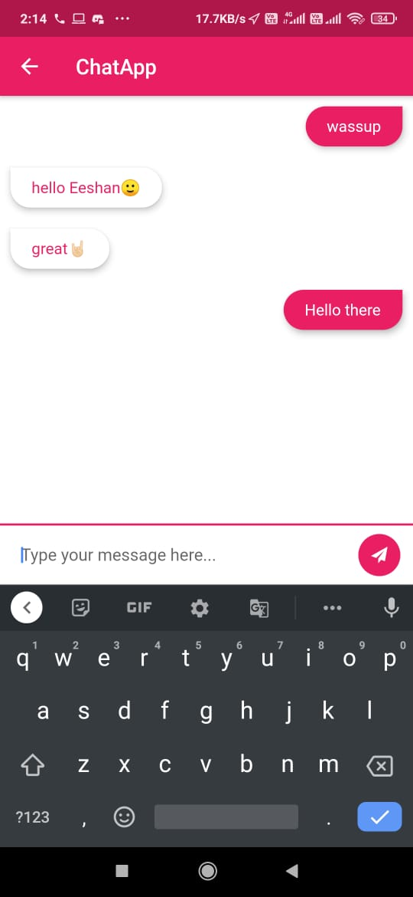 
 
4. Live feed will involve work in database of uploading and seeing data about women empowerment.
 

 

5. Help me voice integration where your current location will be sent to the concerned nearby authorities (works even in background mode or locked mode). This feature will give an call and SMS with the link to your current location once the code is spoken after the phrase 'Help' anytime (that can be set in the profile page along with the number of the person you want to send the message and call to).
 

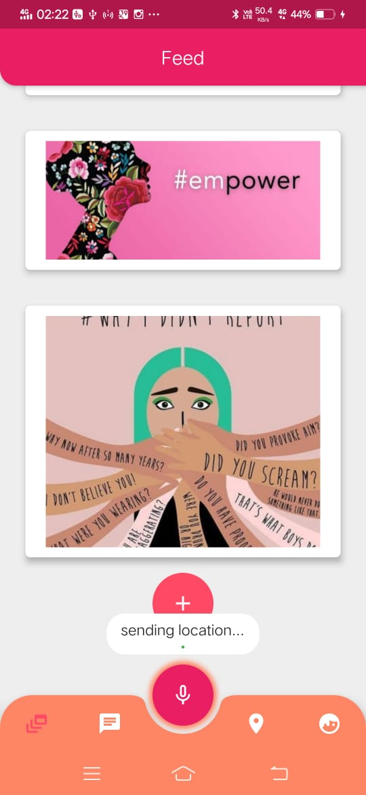 
 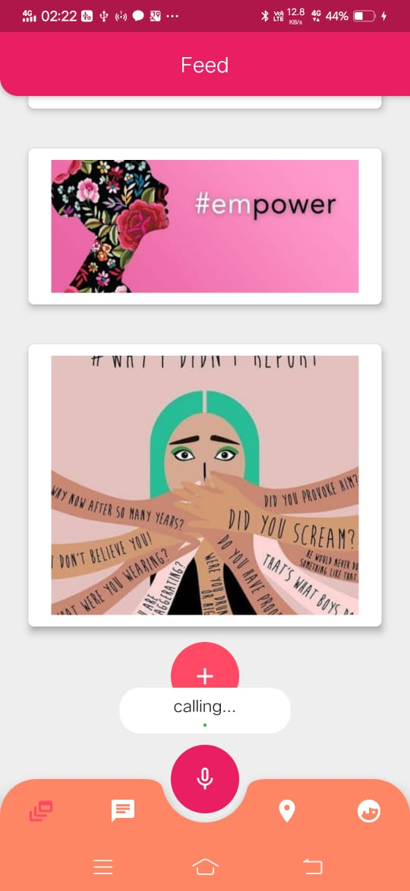 
 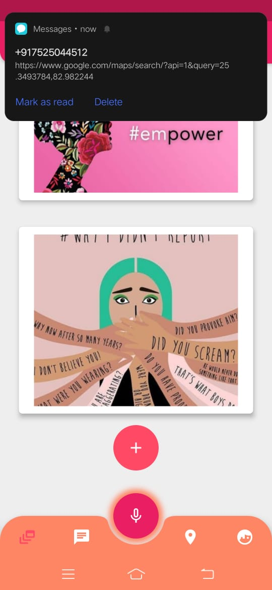 
 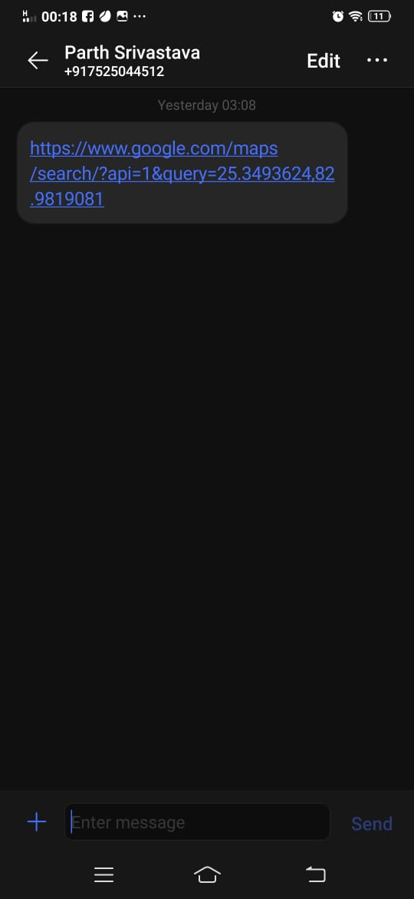 

 
 7. A Profile Page showing your details and consist of Textfield to register the numbers for help me feature. Three numbers can be set in this and the call will be sent to the first number.
 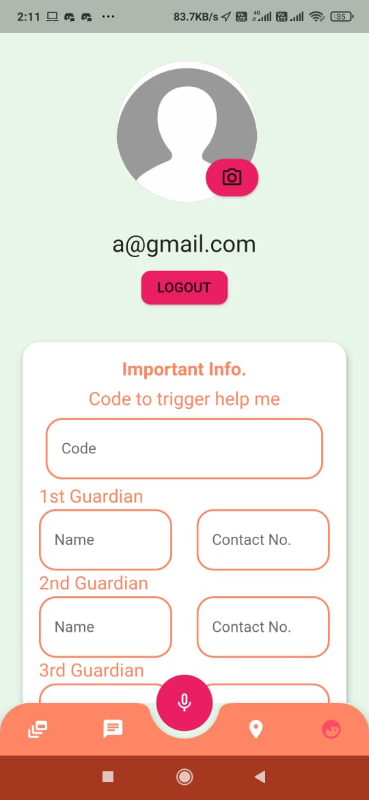

**Developers :-**

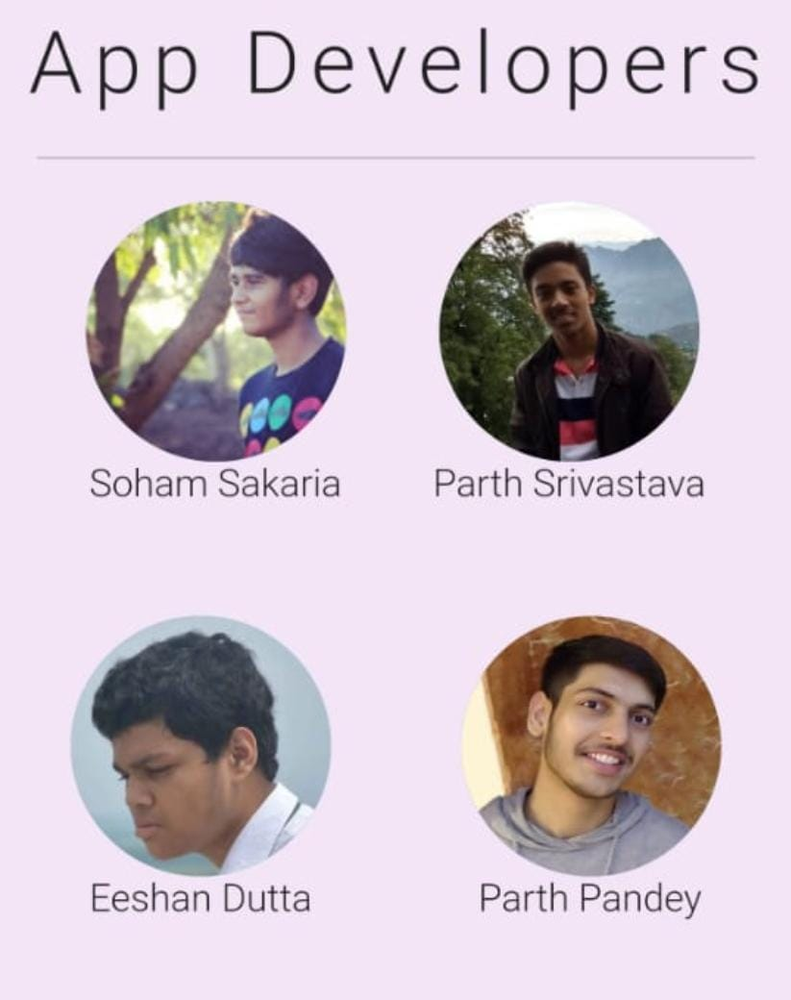 

We have made this Application with the vision of helping the community in any small way possible and just hope that the everyone can walk freely even in mid night and feel safe in general.
   
   Regards,
   
   **Team Ctrl-Alt-Elite**
